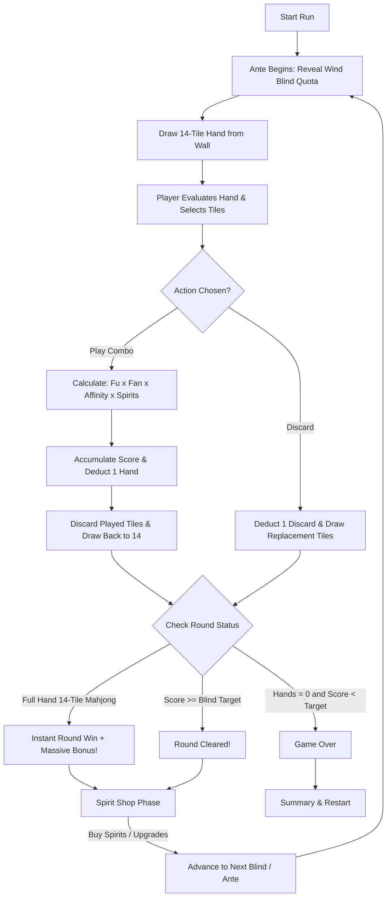

# 🀄 MALAJONG — Game Design Document & Design Rationale

> **Working Title:** Malajong  
> **Genre:** Single-player Roguelike Deckbuilder  
> **Inspirations:** *Balatro* (LocalThunk), *Hong Kong / Riichi Mahjong*, *Slay the Spire* (MegaCrit), *Aotenjo (青天井) Scoring*  
> **Team:** SanRokuNana (CodeCatalyst — Swinburne Technology Club)  
> **Engine:** Unity 6 (2D URP) | **C#**  

---

## 1. Executive Summary & Core Concept

**Malajong** is a single-player roguelike deckbuilder where traditional Mahjong tile play is combined with the high-stakes, exponential scoring loop of *Balatro*. 

Instead of sitting at a 4-player table waiting for discards, the player holds a 14-tile hand drawn from a standard 136-tile Mahjong wall. Over a limited number of **Hands** and **Discards**, the player forms valid Mahjong sets (**Chows, Pongs, Kongs**) and complete winning hands to beat escalating point quotas known as **Wind Blinds**. Between rounds, players enter a **Spirit Shop** to purchase **Spirits (Artifacts)** that modify scoring rules, manipulate tile suits, and trigger wild score multipliers.

---

## 2. Inspirations & "Why These Decisions Were Made"

### 2.1 Why Balatro + Mahjong?
* **The Problem with Standard Mahjong as a Video Game:** Traditional Mahjong requires four players, extensive memorization of 40+ complex Yaku combinations, and long games where a single defensive mistake can lead to an instant loss.
* **The Balatro Breakthrough:** *Balatro* proved that taking a universally recognized physical game (Poker cards) and simplifying it into an escalating single-player solitaire puzzle with exponential math (`Fu × Fan` / `Chips × Mult`) creates an addictive, accessible, and deep roguelike experience.
* **The Malajong Vision:** We translate this same design magic to **Mahjong**. Mahjong tiles possess richer visual aesthetics, unique tile interactions (sequential runs vs. identical sets), and cultural charm that standard playing cards lack.

---

### 2.2 Why Aotenjo Uncapped Scoring Instead of Standard Han/Fan?
* **Traditional Rule Limit:** In standard Mahjong, scoring caps out at *Yakuman* or *Mangan/Haneman* (often limiting the score to 8,000–32,000 points).
* **The Aotenjo (Blue Sky / No Ceiling) Solution:** In Aotenjo rules, Fan multipliers compound exponentially without any ceiling ($2^{\text{Fan}}$).
* **Malajong Scoring Formula:** 
  $$\text{Score} = (\text{Base Fu} + \text{Tile Fu}) \times (\text{Base Fan} \times \text{Affinity Multiplier}) \times \prod \text{Spirit Multipliers}$$
  This delivers the adrenaline rush of seeing numbers climb from $30 \text{ pts}$ to millions of points in late-game Antes.

---

### 2.3 Unique Selling Point (USP): Suit-Locked Synergy vs. 52-Card Poker
* **The Critique:** *"Is this just a Balatro reskin?"*
* **The Structural Asymmetry:** In a standard 52-card deck (Poker), every suit (Spades, Hearts, Clubs, Diamonds) is structurally identical. A Flush or Straight can be made in any suit interchangeably.
* **The Mahjong Asymmetry:**
  1. **Three Numbered Suits:** Bamboo (索), Characters (萬), and Dots (筒) each range from 1 to 9.
  2. **Honor Tiles (Non-sequential):** Winds (East, South, West, North) and Dragons (White, Green, Red) **cannot form Chows (runs)**; they can only form Pongs or Kongs.
  3. **Suit-Commitment Tension:** In Malajong, playing multiple sets of the same suit raises that suit's **Suit Affinity multiplier**. Playing off-suit tiles decays it.
  4. **Deckbuilding Axis:** The player must actively decide whether to pursue a **Pure Hand (Chinitsu mono-suit strategy)**, an **All-Honors strategy**, or a **Multi-suit burst strategy** via specific Spirits like *Broken Compass*.

---

### 2.4 Why the 3-Column UI Layout?
Inspired by commercial arcade deckbuilders, the screen is cleanly partitioned into 3 distinct functional pillars:

```
+-------------------+------------------------------------+-------------------+
|   COLUMN 1 (LEFT)  |         COLUMN 2 (CENTER)          |  COLUMN 3 (RIGHT) |
|   BLIND & STAKES  |       MAHJONG MAT & TRAY           |   SCORE ENGINE    |
|                   |                                    |                   |
| [ East Wind Blind ]| [ Spirit Rack: 5 Passive Slots ]   | Hands: 4 | Disc: 3|
| [ Tile Icon & Quota]| [ Suit Affinity: 1.0x|1.0x|1.0x ]  | Round Score: 0/150|
| [ Yuan: ¥5        ]| [ Sort Suit | Sort Rank | Auto ]   | [================]|
| [ Ante: 1/4       ]| [ 14 Adjacent Touching Tiles    ]  |                   |
| [ Round: 1/5      ]|                                    | [  FU   ] x [ FAN ]|
| [ Run Info / Shop ]| [ PLAY COMBO ]    [ DISCARD ]      | [  50   ] x [ 2.0 ]|
|                   |                                    | = 100 PTS         |
|                   |                                    | Playable Combos   |
+-------------------+------------------------------------+-------------------+
```

1. **Left (Stakes & Context):** Tracks current Ante, Wind Blind target, Boss modifiers, and wallet balance (Yuan ¥).
2. **Center (Action & Tactile Play):** Features the 14-tile Mahjong tray with physical-feeling adjacent tiles that lift on hover/select, sorting quick-bars, and the 5-slot Spirit Rack.
3. **Right (The Math Engine):** The iconic Dual-Box HUD (`Fu` in Blue, `Fan` in Red) that reacts dynamically in real-time as you select tiles before you click Play.

---

## 3. Core Gameplay Loop



1. **Ante Initiation:** Quota is revealed (e.g. 150 points for East Wind Small Blind).
2. **Draw Hand:** 14 tiles dealt from the 136-tile wall.
3. **Player Turn Actions:**
   - **Play Combo (Costs 1 Hand):** Select 2 to 4 tiles forming a valid set (Chow, Pong, Kong, or Pair). The combo scores Fu × Fan, awards Suit Affinity, triggers Spirit passives, and refills back to 14 tiles.
   - **Discard (Costs 1 Discard):** Select 1 to 5 unwanted tiles to discard and draw fresh tiles from the wall.
   - **Instant Full Hand (Mahjong!):** If all 14 tiles form 4 complete sets + 1 pair, the round ends **immediately with an 8.0x Fan multiplier bonus**, saving all remaining Hands!
4. **Shop Phase:** Bank unspent Hands as bonus currency (¥1 Yuan per remaining hand), then purchase new Spirits (¥5 Yuan each) or consumables.
5. **Ante Progression:** 4 Antes (East, South, West, North), each with 5 Rounds culminating in Boss Blinds with special gameplay restrictions.

---

## 4. Tile System & Combo Hierarchy

### 4.1 The 136-Tile Deck Composition

| Category | Suit Name | Ranks / Glyphs | Copies | Total Tiles |
|---|---|---|---|---|
| **Numbered Suit** | **Bamboo (索 - Sou)** | 1 through 9 | 4 each | 36 tiles |
| **Numbered Suit** | **Characters (萬 - Wan)** | 1 through 9 | 4 each | 36 tiles |
| **Numbered Suit** | **Dots (筒 - Pin)** | 1 through 9 | 4 each | 36 tiles |
| **Honor: Winds** | **East, South, West, North** (東 南 西 北) | - | 4 each | 16 tiles |
| **Honor: Dragons** | **White, Green, Red** (白 發 中) | - | 4 each | 12 tiles |
| **Total Deck** | | | | **136 tiles** |

---

### 4.2 Standard Combos & Scoring Base Table

| Combo | Tiles Required | Description | Base Fu | Base Fan | Affinity Gain |
|---|---|---|---|---|---|
| **Pair (Toitsu)** | 2 identical tiles | Eye of the hand | 5 | 1.0x | +0.0x |
| **Chow (Shuntsu)** | 3 sequential tiles (same suit) | e.g. 3-4-5 Bamboo | 15 | 2.0x | +0.1x |
| **Pong (Koutsu)** | 3 identical tiles | e.g. 7-7-7 Characters | 20 | 2.0x | +0.1x |
| **Kong (Kantsu)** | 4 identical tiles | e.g. 9-9-9-9 Dots | 40 | 3.0x | +0.2x |
| **Concealed Kong (Ankan)** | 4 self-drawn identical tiles | High risk/reward | 55 | 4.0x | +0.4x |
| **Full Hand (Mahjong!)** | 14 tiles (4 sets + 1 pair) | Instant round completion | 100 | 8.0x | +0.5x |

---

### 4.3 High-Tier Hand Modifiers (Yaku Post-Checks)

* **Pure Hand (Chinitsu / 清一色):** All played tiles belong to a single numbered suit (excluding Honors). Adds **+150 Fu** and **10.0x Fan**!
* **All Honors (Tsuuissou / 字一色):** Hand is composed entirely of Winds and Dragons. Adds **+180 Fu** and **12.0x Fan**!

---

## 5. Spirits (Artifacts) System

Spirits are passive collectible cards (akin to Balatro's Jokers). Up to **5 Spirits** can be equipped simultaneously.

### 5.1 Showcase Spirits

```
+-----------------------+-----------------------+-----------------------+
|      BAMBOO VOW       |    BROKEN COMPASS     |     COMPASS ROSE      |
|  [ Rare Artifact ]    |  [ Uncommon Artifact] |  [ Common Artifact ]  |
|                       |                       |                       |
| +0.5x Fan per Chow    | Playing 2 different   | The suit with the     |
| or Pong played in     | suits in one turn     | highest current       |
| Bamboo this round.    | gives +20 Flat Fu,    | Affinity adds +1 Fu   |
| Resets on off-suit.   | but zeroes Affinity.  | per tile played.      |
+-----------------------+-----------------------+-----------------------+
```

1. **Bamboo Vow:** Demonstrates **Mono-suit Commitment**. Rewards disciplined suit focus.
2. **Broken Compass:** Demonstrates **Multi-suit Burst**. Gives a safety valve for bad draws at the cost of long-term affinity.
3. **Green Dragon Spirit:** Demonstrates **Honor Utility**. Grants utility/freeze protection on Green Dragon Pongs.
4. **Compass Rose:** Demonstrates **Dynamic Run Reading**. Adapts its bonus to whichever suit the player is currently prioritizing.

---

## 6. Visual & Audio Polish Specifications

1. **Pixel Art Foundation:** Hand-crafted 46x62 pixel art tiles from *Blueeyedrat*, upscaled smoothly to 70x95px on the table.
2. **Retro Display Typography:** Integrated **`m5x7`** crisp pixel font with large point sizes (24px–54px) for readability at 1080p.
3. **Juicy Micro-Interactions:**
   - Smooth vertical `Lerp` lifts (+36px) on hover and selection without layout jitter.
   - Live color-coded preview in the Dual-Box HUD (Gold for valid combos, Red for invalid).
   - Floating text badges on action confirmation (`SORTED BY SUIT`, `+50 FU!`, `2.0X FAN`).
4. **Audio Feedback:** Authentic physical Mahjong tile clacks on select/deselect, ascending pitch blips during scoring calculations, and cash register chimes upon shop purchases.
